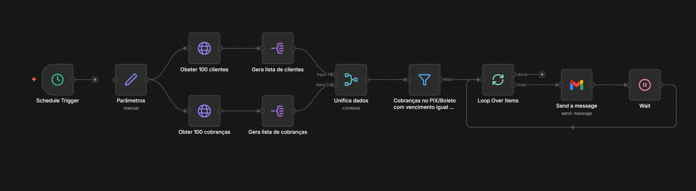

# 💸 Automação de Lembrete de Cobranças (n8n + Asaas)

Automação para envio de lembretes de cobrança por e-mail para clientes com faturas próximas do vencimento.

> ⚠️ Este projeto NÃO contém credenciais ou dados sensíveis.

---

## 📸 Fluxo da Automação

---

## 🚀 Funcionalidades

- Execução automática com agendamento  
- Consulta de clientes  
- Consulta de cobranças pendentes  
- Associação entre cliente e cobrança  
- Filtro por vencimento próximo  
- Envio de e-mails personalizados  
- Controle de envio com intervalo (anti-spam)  

---

## 📂 Estrutura do Projeto
📦 n8n-cobrancas-automatizadas
┣ 📜 workflow.json
┣ 🖼️ workflow.png
┗ 📜 README.md

---

## 🛠️ Tecnologias

- n8n  
- API de pagamentos (ex: Asaas)  
- Gmail / SMTP  

---

## ⚙️ Configuração

Use variáveis de ambiente ou credenciais do n8n.

Exemplo:
API_URL=sua_url
API_TOKEN=seu_token
DIAS_VENCIMENTO=5

---

## ▶️ Como usar

1. Importar o workflow no n8n  
2. Configurar credenciais  
3. Ativar o agendamento  

---

## ⚠️ Boas práticas

- Nunca subir tokens no GitHub  
- Implementar paginação  
- Evitar envios duplicados  
- Testar em ambiente de homologação  

---

## 📄 Licença

Uso livre para fins educacionais e comerciais.
